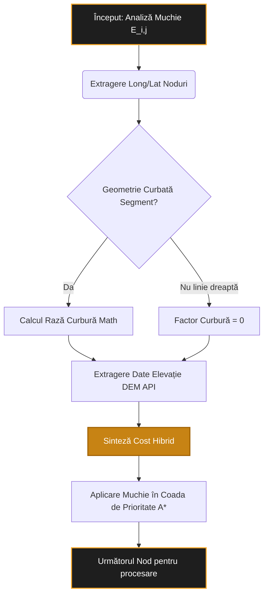

# Documentație Lucrare de Licență: ApexRoute

## 1. Cuprinsul Lucrării (Tezei)
> Această secțiune acoperă cerința: *Content of the thesis*.

1. **Introducere**
   1.1. Contextul și motivarea alegerii temei
   1.2. Obiectivul principal al aplicației
   1.3. Structura lucrării
2. **Fundamente Teoretice și Tehnologii Utilizate**
   2.1. Ecosistemul Android și Dezvoltarea Modernă
   2.2. Algoritmi de Rutare în Rețele de Transport
   2.3. Calculul Scorului de Plăcere Geografică
3. **Analiza și Proiectarea Sistemului**
   3.1. Specificarea cerințelor funcționale și non-funcționale
   3.2. Arhitectura sistemului (Clean Architecture)
   3.3. Diagrame UML (Use Case, Activity, Class)
4. **Detalii de Implementare**
   4.1. Interfața grafică cu Jetpack Compose
   4.2. Integrarea datelor OSM și Mapbox SDK
   4.3. Implementarea algoritmului Custom A*
5. **Testare și Evaluare**
   5.1. Testare Unitară
   5.2. Performanța generării de trasee
6. **Concluzii și Direcții Viitoare**
   6.1. Rezumatul realizărilor
   6.2. Evoluții posibile
7. **Bibliografie**

---

## 2. Fundamente Teoretice și Tehnologii Utilizate
> Această secțiune acoperă cerința: *Chapter theoretic 1 + subsections* și *Formatting: tables/images*.

### 2.1 Ecosistemul Android și Dezvoltarea Modernă
Dezvoltarea aplicațiilor mobile pentru sistemul de operare Android a evoluat semnificativ în ultimii ani. Tradițional, interfețele grafice erau construite folosind fișiere XML și manipulări imperative ale vederilor (*Views*) din codul Java sau Kotlin. Odată cu introducerea bibliotecii **Jetpack Compose**, paradigma a devenit una pur **declarativă**. 

În Jetpack Compose, dezvoltatorul descrie *cum* ar trebui să arate interfața la o anumită stare a datelor, iar framework-ul se ocupă cu redesenarea inteligentă (*recomposition*) doar a componentelor afectate de modificările de stare. Kotlin, ca limbaj principal recomandat de Google, oferă suport extins pentru coroutine, facilitând astfel operațiile asincrone și managementul stărilor complexe necesare într-o aplicație de navigație.

### 2.2 Algoritmi de Rutare în Rețele de Transport
Pentru a putea naviga de la un punct A la un punct B pe o hartă, sistemele geografice modelează rețeaua stradală sub forma unui graf orientat $G = (V, E)$, unde $V$ reprezintă setul de noduri (intersecțiile), iar $E$ reprezintă setul de muchii (segmentele de stradă).

Problema determinării celui mai bun traseu se reduce matematic la problema determinării drumului de cost minim între două noduri din graf. 
Cei mai cunoscuți algoritmi pentru această problemă sunt **Dijkstra** și **A*** (A-Star). A* extinde algoritmul Dijkstra prin introducerea unei funcții euristice $h(n)$ care estimează costul de la nodul curent până la nodul destinație, ghidând căutarea direct spre țintă și reducând spațiul stărilor vizitate.

**Tabelul 2.1:** Comparație între parametrii și comportamentul algoritmilor de rutare.

| Caracteristică | Algoritmul Dijkstra | Algoritmul A* (A-Star) |
| :--- | :--- | :--- |
| **Găsirea Rutei Optime** | Da (garantează costul minim) | Da (dacă euristica este admisibilă) |
| **Funcție Euristică** | Nu folosește ($h(n) = 0$) | Folosește estimare distanță (ex: Haversine) |
| **Eficiență Spațială** | Vizitează radial toate direcțiile | Orientat către destinație (mai rapid) |
| **Complexitate (Caz Mediu)** | Mai lent (explorează exhaustiv) | Foarte rapid și direct în rețele stradale |

### 2.3 Calculul Scorului de Plăcere Geografică (Cost Adaptiv)
Spre deosebire de sistemele tradiționale precum Google Maps, a căror pondere aplicată pe o muchie este strict dictată de factorul de *timp real de sosire (ETA)* sau *distanță spațială minimă*, aplicația ApexRoute prioritizează **factorul de curbură** și **diferențele de elevație**.

Astfel, funcția de cost pentru o muchie $E_{i,j}$ nu mai reprezintă lungimea segmentului, ci o formulă matematică hibridă:
`Cost = (α * Distanță) + (β * Elevație) - (γ * Curbură)`

Unde coeficienții (α, β, γ) reglează preferința matematică pe model. Dacă (γ) este masiv, funcția de penalizare devine un bonus pentru drumurile drepte, orientând A* către strazile curbate (scăzând costul pe acestea).

Procesul tehnologic prin care sistemul adaugă această greutate hibridă fiecărui segment stradal din rețeaua geografică OpenStreetMap este ilustrat în figura de mai jos:

*Figura 2.1: Diagrama de activitate tehnologica pentru sinteza costului hibrid per segment de stradă.*

Modelul prezentat deosebește conceptual aplicația ApexRoute de sistemele de planificare de rută A-to-B generice și implementează nucleul inovației din această lucrare.
